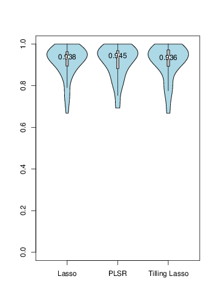

```{r, echo=FALSE, message=FALSE}
library(Seurat); library(honfleuR)
```

# Introduction


As an extension for `seurat` package, `honfleuR` has the following chases: 

- Incorporate new algorithms to expand its capability of learning data.
- Design and enrich functions and parameters to make `seurat` compatible with more research of interests.
- Improve running speed while following `seurat` syntax and reproducing results.

# Summary of changes

```{r, echo=FALSE, results='asis'}
funcS1 <- c('addImputedScore', 'fit.gene.k', 'initial.mapping', 'refined.mapping')
funcS2 <- c('jackStraw')
funcH1 <- c('fill_imputed_expr', 'fit_gene_k', 'initial_mapping', 'refined_mapping')
funcH2 <- c('jackStraw2')
news1 <- c('interface for additional imputation strategies',
          '10X faster; strict control of biological meanings',
          '1X faster',
          '17X faster')
news2 <- c('debug')
funcS <- c(funcS1, funcS2)
funcH <- c(funcH1, funcH2)
news <- c(news1, news2)
usage <- c(rep('Localization', length(funcS1)),
           rep('Clustering', length(funcS2)))
report <- data.frame(cbind(usage, funcS, funcH, news))
colnames(report) <- c('Category', 'Seurat', 'honfleuR', 'What\'s New')
knitr::kable(report)
```

`eval_seurat` function evaluates Seurat performances on landmark genes and draws ROC curves, reproducing Fig3-G&H.

# Data imputation - `fill_imputed_expr`
Impute expression of each landmak gene (response) based on other genes with variable expressions (predictors). 

`honfleuR` has three imputation strategies: 

1. Lasso. Reproduce the results of `seurat`.
2. PLSR. Account for potential linear dependencies among predictors.
3. Tilling lasso. Learn the data structure and perform imputation.

<!--  -->

| Step | Lasso                                                                                                                         | PLSR                                                                                                                    | Tilling Lasso                                                                                                              |
|--------|-------------------------------------------------------------------------------------------------------------------------------|-------------------------------------------------------------------------------------------------------------------------|----------------------------------------------------------------------------------------------------------------------------|
| 1      | Focus on specific landmark gene *G*.                                                                                          | Focus on specific landmark gene *G*.                                                                                    | Focus on specific landmark gene *G*.                                                                                       |
| 2      | Given the matrix with cells ID on rows and genes on columns, train **linear regression** model with **lasso** regularization. | Given the matrix with cells ID on rows and genes on columns, train a **PLSR** (Partial Least Squares Regression) model. | Given the data matrix with cells ID on rows and genes on columns, **shuffle rows randomly**.                               |
| 3      |                                                                                                                               |                                                                                                                         | Set first 20% samples as "unseen" data.                                                                                    |
| 4      |                                                                                                                               |                                                                                                                         | Use the rest 80% samples as training dataset to train a lasso model.                                                       |
| 5      |                                                                                                                               |                                                                                                                         | Apply the model on samples selected on Step 2, impute landmark gene expression in these cells.                             |
| 6      |                                                                                                                               |                                                                                                                         | Set second 20% samples as "unseen" data. Repeat Step 3-5 until the expression of landmark gene is imputed among all cells. |
| 7      | Apply lasso model on same matrix to impute expression of gene *G*.                                                            | Apply PLSR model on same matrix to impute expression of gene *G*.                                                       | Repeat Step 2-6 for 10 times. The average values are the imputed expressions for gene *G* among all cells.                 |
| 8      | Iterate Step 1-7 for other landmark genes.                                                                                    | Iterate Step 1-7 for other landmark genes.                                                                              | Iterate Step 1-7 for other landmark genes.                                                                                 |

## Use Lasso

Run the following codes to test whether `honfleuR` reproduces results. 

```r
##-- Load data generated from seurat's Tutorial-2.
load('data/output_part2.Robj')
genes.sig <- pca.sig.genes(zf,pcs.use = c(1,2,3), pval.cut = 1e-2, use.full = TRUE)
insitu.genes <- colnames(zf@insitu.matrix)
lasso.genes.use <- unique(c(genes.sig, zf@var.genes))
```

```r
zf@imputed <- data.frame()
zf0 <- addImputedScore(zf, genes.use = lasso.genes.use, genes.fit = insitu.genes, 
                       do.print = FALSE, s.use = 40, gram = FALSE)
zf@imputed <- data.frame()
zf1 <- fill_imputed_expr(zf, genes.use = lasso.genes.use, genes.fit = insitu.genes, 
                         scheme = "lasso",
                         do.print = F, s.use = 40, gram = F)
all.equal(zf0@imputed, zf1@imputed)
```

The result is (expected to be) `TRUE`. 

## Use PLSR

```r
zf <- fill_imputed_expr(zf, genes.use = lasso.genes.use, genes.fit = insitu.genes,
                        scheme = "plsr")
```

## Use Tilling-lasso

```r
zf1 <- fill_imputed_expr(zf, genes.use = lasso.genes.use, genes.fit = insitu.genes, 
                         scheme = "tlasso",
                         do.print = F, s.use = 40, gram = F)
```

## Quick summary
1. `honfleuR` expands `seurat` capability in addition to linear regression.
10. The interface of `honfleuR` is unified, i.e. setting parameter`scheme = c('lasso', 'plsr', 'tlasso')`.
20. `honfleuR` follows the `seurat` syntax and does not alter `seurat`'s codes frame.

## ROC analysis for imputation scheems

As the way of performing ROC analysis as in Figure 3H of manuscript, the following AUC results are given by using `honfleuR`'s `eval_seurat` function.



# Estimate bimodal distributiion of landmark gene - `fit_gene_k`

First, `honfleuR` **fixes a bug** related with biology. There is a biological issue that original `fit.gene.k` omits. There are following two scenarios: 

```R
fit.gene.k(zf, "SOX3", do.k = 3)
```

`do.k = 3` means it is assumed that the in situ pattern of gene *G* has 3 expression levels: low, med, high. In tutorial it was default as 2.

```R
fit.gene.k(zf, "SOX3", start.pct=mean(zf@insitu.matrix[,"SOX3"]))
```

`start.pct` sets the initial percentage of cells in "on" state therefore the dataset is expected to be binary if `start.pct` is in action.

The above two calls are appropriate. However, current implementation of `seurat` allows the following extreme case taking place legally: 

```R
fit.gene.k(zf,"SOX3", do.k = 5, start.pct=mean(zf@insitu.matrix[,"SOX3"]))
```

It is conflict that five (any number greater than 2) different expression levels and "on/off" presumption coexists. Therefore `honfleuR` comes up with a patch, see `fit_gene_k`. 

Furthermore, `fit_gene_k` is **10X** faster than `fit.gene.k`. Run the following codes to see the efficiency boost (on my laptop decrease from 24s down to 2s).

```r
load('data/output_part2.Robj')
insitu.genes <- colnames(zf@insitu.matrix)
system.time(
  for (g in rev(insitu.genes)) {
    zf0 <- fit.gene.k(zf, g, do.k = 2, start.pct=mean(zf@insitu.matrix[, g]),
                      num.iter = 1, do.plot=FALSE)
  })
load('data/output_part2.Robj')
system.time(
  for (g in rev(insitu.genes)) {
    zf1 <- fit_gene_k(zf, g, do.k = 2, start.pct=mean(zf@insitu.matrix[, g]),
                      num.iter = 1, do.plot=FALSE)
  })
all.equal(zf0@mix.probs, zf1@mix.probs)
```

The result is `TRUE` meaning that `honfleuR` builds the model more efficiently without losing correctness. See results [here](https://github.com/Puriney/honfleuR/wiki/Performance-enhancements-for-bimodal-distributions-estimation) estimated by using `microbenchmark` package.


# Cells mapping - `initial_mapping` and `refined_mapping`

`initial_mapping` and `refined_mapping` exactly follows twins functions `initial.mapping` and `refined.mapping` respectively. 

`initial_mapping` is **1X** faster (11s down to 5s), and `refined_mapping` is **17X** times faster (98s down to 5s). See boosting results [here](https://github.com/Puriney/honfleuR/wiki/Performance-enhancements-for-mapping-cells-location-part) estimated by using `microbenchmark` package.
